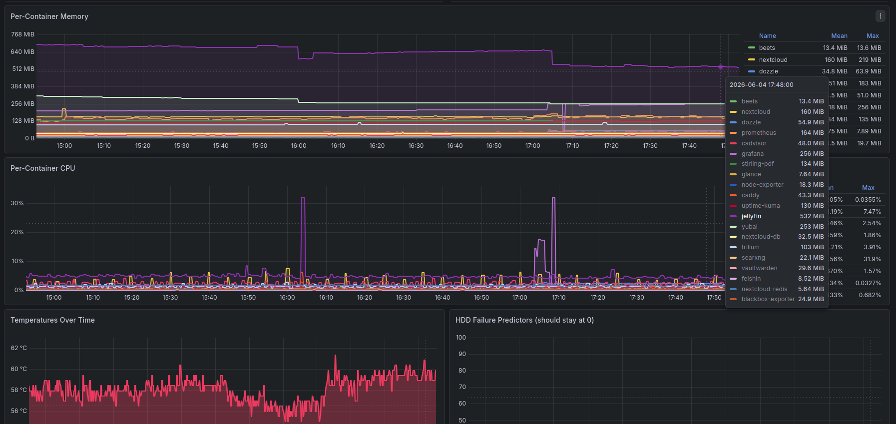

There is a specific moment in every self-hoster's journey where the project stops being about technology and becomes about something harder to name. For me it happened at 2am, hunched over a terminal, chasing a silent metadata bug that had been quietly corrupting my music library for weeks. No error message. No log entry. Just wrong data, perfectly stored.

I could have been asleep. I could have been paying Spotify eleven euros a month for the privilege of not caring. Instead I was debugging Vorbis comment field specifications at two in the morning, and — this is the part that's hard to explain to non-hobbyists — I was genuinely enjoying it.

That's the thing about building your own infrastructure. The failure modes become yours. And that turns out to matter more than I expected.

---

## The Philosophy: Why Self-Host at All?

The honest answer isn't privacy, though privacy is part of it. It isn't cost, though the economics eventually favor ownership. It isn't even the hacker ethos of *building things yourself*, though that's in the mix too.

The honest answer is **dependency exhaustion**.

Over the past decade I watched cloud services undergo a predictable lifecycle: launch with generous free tiers, accumulate users, raise prices, degrade the product, and occasionally just disappear. Google Reader. Picasa. Dropbox's generous sync limits. Plex's pivot to a mandatory cloud account for a locally-running media server. Each one a small act of trust, eventually broken.

Self-hosting inverts the risk model. Instead of trusting that a company's incentives will remain aligned with mine, I'm trusting hardware, software I can read, and my own ability to maintain it. Those failure modes are finite and legible. A hard drive fails. Power goes out. A Docker image stops receiving updates. These are problems with known solutions, not Terms of Service changes announced on a Friday afternoon.

There's also a subtler benefit that I didn't anticipate: **operational intimacy**. When you build a system from scratch, you develop a mental model of it that no onboarding guide can replicate. I know why Jellyfin loses artist metadata on a library rescan — because I spent two hours diagnosing it. I know the exact HTTP endpoint to trigger a full metadata refresh. I know which service is eating memory under load. This isn't encyclopedic knowledge; it's the specific, structural understanding that comes from building something and then watching it break.

Rented infrastructure feels like living in a furnished apartment. Everything works until it doesn't, and when it doesn't, you call someone else. Owned infrastructure feels like a house you built. You know where the pipes are.

---

## The Hardware: Constraints as Features

The build centers on a **Raspberry Pi 4** — a single-board ARM computer about the size of a credit card, drawing roughly five watts at idle. This was a deliberate choice, not a budget compromise.

Choosing constrained hardware forces discipline. A Pi 4 cannot run forty Docker containers without consequences. Memory limits matter. Image architecture matters — every service in the stack must publish an ARM64-compatible image, or it doesn't get added. This constraint has, counterintuitively, made the stack *better*. Bloated or poorly-maintained projects get filtered out early.

The machine lives on a shelf connected to a **2TB spinning HDD**. Yes, spinning rust in the SSD era. The calculus here is simple: media libraries are large, cold-ish storage, where cost-per-gigabyte still favors HDDs by a factor of four or five. Seek latency doesn't matter when you're streaming a single audio file. The trade-off — noise, mechanical failure risk, slower bulk reads — is acceptable for a home use case.

Networking is handled by **Tailscale**, which has quietly become the most underrated piece of software in the self-hosting stack. Historically, running a home server accessible from outside your LAN meant one of three things: open ports and NAT traversal, a commercial VPN with its own maintenance burden, or accepting that remote access was sufficiently painful to avoid. Tailscale eliminates all three options in favor of a zero-configuration mesh network where the Pi simply appears at `nas.tailfa****.ts.net` from any device on the tailnet. No firewall rules. No open ports. No dedicated VPN server to maintain.

What Tailscale also does, invisibly and without fanfare, is solve the **split-brain DNS problem** — the headache of services needing different addresses depending on whether you're on the local network or outside it. With Tailscale, there is one address. It always works. This sounds trivial until you've spent time managing split DNS configs.

---

## The Stack: Nineteen Services, One Compose File

The entire service fleet lives in `~/stack/` as a single Docker Compose project. Application data goes under `/mnt/nas/appdata/`, on the external drive, separated from the stack config intentionally. Code and configuration live in the home directory, potentially in version control. Persistent state lives on the drive. A full stack rebuild doesn't touch data. A data migration doesn't require touching config. This separation has saved me twice.

### Media: Jellyfin

**Jellyfin** is the media server — the open-source, no-account-required alternative to Plex. The ARM64 Docker image is well-maintained and handles the workload gracefully. Transcoding on Pi-class hardware works adequately for the primary use case: direct-play Opus audio and H264 video to a single client. When transcoding is unavoidable, you notice the latency. For everything else, it's invisible.

The interesting Jellyfin challenge was not performance but **metadata indexing**. The music library is populated primarily by Yubal (more on that shortly), which writes artist tags to non-standard Vorbis comment fields: `ARTISTS`, `ALBUMARTISTS`, `ALBUM_ARTIST`, and `ALBUM_ARTISTS`. Jellyfin, following the spec, reads only the canonical `ARTIST` and `ALBUMARTIST` fields by default.

The symptom was deeply confusing: tracks appeared in the library. Albums appeared. Artists did not. The library scan completed without errors and reported zero issues. The data was there, correctly stored in the file. Jellyfin simply wasn't reading it.

The fix is a single toggle — *Use non-standard artist tags* in the Manage Library panel — but reaching that fix required understanding the Vorbis comment specification well enough to diff what Yubal was writing against what Jellyfin was reading. It also required learning, somewhat bitterly, that Jellyfin's `/Artists` search API has a bug where the `searchTerm` query parameter returns `TotalRecordCount: 0` even when the `Items` array is populated, which makes programmatic validation harder than it should be. Debugging a metadata pipeline when your diagnostic tools are themselves unreliable is a specific kind of frustrating.

### Cloud Storage: Nextcloud

**Nextcloud** is the largest surface area of complexity in the stack — file sync, photo management, calendar, contacts, office documents, all behind a web interface. It's the service most analogous to a commercial product (Google Workspace, iCloud), and consequently the one that fights back the hardest when self-hosted.

Nextcloud's complexity comes partly from its architecture (a PHP application with a database backend, a background job system, and a separate high-performance file backend for large libraries) and partly from its sensitivity to configuration drift. Small mismatches between the Nextcloud config, the reverse proxy headers, and the underlying database accumulate into persistent warning states that are individually benign but collectively exhausting to manage.

Running it behind Caddy introduces its own constraints: `X-Forwarded-For` headers must be configured correctly or Nextcloud logs every request as originating from the proxy IP. Trusted proxies must be explicitly listed. The `overwriteprotocol` config must match what Caddy is actually serving. None of this is undocumented — Nextcloud's documentation is extensive — but the configuration surface is large enough that something is almost always slightly wrong.

### Music Acquisition: Yubal

**Yubal** is the most idiosyncratic piece of the stack: a YouTube Music → local library pipeline that runs on a nightly cron, downloads curated playlists as Opus files, and drops them directly into Jellyfin's music folder. No manual intervention. No subscription. Music library stays current.

The configuration is specific: `YUBAL_AUDIO_FORMAT=opus`, cron at `0 3 * * *`, memory-limited to 384MB, running as `1000:1000` to match file ownership with the rest of the stack. Bind mount points directly to the Jellyfin music folder.

That last detail — the bind mount — was the source of an expensive early mistake. During initial deployment, the volume mount was misconfigured: the container started, downloaded several hundred files successfully, and those files were written to the **ephemeral container layer** rather than the mounted host directory. When the container was recreated with the corrected mount, that layer was gone. A full playlist of Liberato tracks and Gazzelle's *Punk* album — representing a significant fraction of the Italian indie portion of the library — simply ceased to exist. No error. No warning. They'd never been on disk in the first place.

The lesson is somewhat obvious in retrospect: validate bind mounts *before* the first container run, not after. `docker inspect` shows you mounted volumes; checking that the host path exists and is writable costs thirty seconds. I now check. Every time.

### Music Tagging: Beets and the AcoustID Problem

**Beets** is the standard self-hosted music tagging solution, and for most libraries it works extraordinarily well: it fingerprints audio files using AcoustID/Chromaprint, matches against the MusicBrainz database, and writes correct metadata. The automation is genuinely impressive.

For *this* library, it is nearly useless.

The music library is dominated by live recordings, DJ mixes, regional Italian indie artists, fan-compiled discographies, and album edits that never appeared on any official release. MusicBrainz coverage for this content is thin to nonexistent. AcoustID fingerprinting against a database that doesn't have your recordings returns nothing. Running mass AcoustID import on this library produced matches on perhaps fifteen percent of files, mostly the mainstream tracks that didn't need tagging anyway.

The solution was a fallback: a Python script, `tag_from_path.py`, using the `mutagen` library to read metadata directly from folder structure. The convention `Artist/Album/Track.ext` is assumed. The script is idempotent — it won't overwrite tags that already exist unless forced — and dry-run by default. Running it on the untagged portion of the library worked far better than any fingerprint-based approach would have.

This episode reinforced something important about automation: **the quality of an automated solution is bounded by the quality of the data it depends on**. AcoustID is an excellent solution for mainstream, officially-released, widely-fingerprinted music. For a niche, live-heavy, regional library, the data simply isn't there, and no amount of configuration improves that. Recognizing when to abandon the sophisticated approach in favor of the simple one is a real skill.

---

## The Routing Problem: HSTS, Subpaths, and the Limits of Clever Proxying

The most frustrating category of homelab problems is the one where everything is technically correct and nothing works anyway.

**Caddy** handles reverse proxying for all services, terminating TLS and routing by subdomain. This works beautifully for services that expect to live at a root path. For Yubal — a single-page application built with TanStack Router — it broke in a specific and instructive way.

The goal was to serve Yubal at `http://nas/yubal` rather than a dedicated subdomain or port. Caddy's `handle_path` directive can rewrite the path prefix before forwarding the request, so the proxy side is straightforward. The problem is the application side: TanStack Router builds with absolute path assumptions baked into the generated JavaScript. Without a configured `basePath`, the app's internal routing emits links to `/`, not `/yubal/`. The rewritten proxy request arrives correctly. The app's own navigation then sends the browser back to the root, where Caddy finds nothing. The result is a broken SPA that requires rebuilding the application with correct base URL configuration — a change that must be made upstream, not in the proxy layer.

The interim solution is unglamorous: access Yubal via direct Tailscale IP and port (`http://100.109.41.110:8000`). This works, but exposes a second problem: the `.ts.net` hostname is in browsers' **HSTS preload lists**. HTTP requests to `nas.tailfa80f9.ts.net` are silently upgraded to HTTPS by Chrome, Firefox, and Safari — including in private/incognito tabs, where you might expect the HSTS cache to be absent. The preload list is baked into the browser binary, not the cache. There is no clearing it for a specific domain without a browser-level patch.

Direct IP access sidesteps both problems. It's a workaround, not a solution, and it's on the roadmap.

---

## What's Coming

A homelab is never finished. The honest backlog:

**Recovering the missing music.** The Liberato and Gazzelle files lost to the volume mount misconfiguration need to be re-downloaded. Yubal supports per-playlist re-runs; the fix is ten minutes of work that keeps getting deprioritized behind more interesting problems.

**Nextcloud stability.** The persistent warning states and configuration drift in Nextcloud need a proper audit rather than individual firefighting. This means going through every warning in the admin panel, understanding whether it's genuinely harmful or merely cosmetic, and fixing or suppressing each one with intention.

**Yubal subpath routing.** The correct fix is configuring a `basePath` in TanStack Router and rebuilding the Yubal container image. This requires a fork or upstream contribution, which raises the activation energy significantly. The alternative — a dedicated subdomain with proper HTTPS — is less elegant but immediately achievable via Caddy and a local DNS entry.

**3-2-1 backup strategy.** Currently the stack has local redundancy but no offsite backup. For the music library — a curated collection built over years — this is an unacceptable risk. The target architecture is local copy on the Pi, local copy on a second drive, and an encrypted offsite copy to cloud storage. The music library and Nextcloud data are the irreplaceable portions; appdata can be reconstructed from config.

**Monitoring.** Running nineteen services without observability is flying blind. Uptime Kuma for availability checks, and eventually some lightweight metrics collection, would surface problems before they become data loss. Currently I find out a service is down when I try to use it.

---

## Conclusion: The Knowledge You Can't Buy

Building this stack took substantially longer than subscribing to the services it replaces. It is harder to maintain. When things break, there is no support ticket to file. There are nights when the simplest possible fix would have been to just pay for Plex.

But the Pi on the shelf running these nineteen services has produced something that subscriptions cannot: **a working mental model of how the software actually functions**. Not a user's model, built from UI affordances and marketing copy. An operator's model, built from reading error logs, tracing network requests, and understanding why the Vorbis comment field `ALBUM_ARTIST` is distinct from `ALBUMARTIST` in ways that silently break indexing.

That knowledge doesn't deprecate. It transfers. The debugging instincts developed chasing a Jellyfin metadata bug apply to every distributed system I'll ever work on. The discipline of idempotent, dry-run-safe automation applies to every script I'll ever write. The habit of validating assumptions before running irreversible operations — checking the bind mount before the first container start — is now reflex.

Self-hosting is sometimes described as a hobby for people who enjoy unnecessary complexity. I'd reframe it: it's a practice for people who want to understand their tools well enough to fix them. The complexity isn't the point. The understanding is.

The machine runs. Five watts. Twenty-four hours a day. Entirely mine.

---

*Stack: Raspberry Pi 4 · Docker Compose · Caddy · Tailscale · Jellyfin · Nextcloud · Yubal · Beets · 19 services*
*Written June 2026*